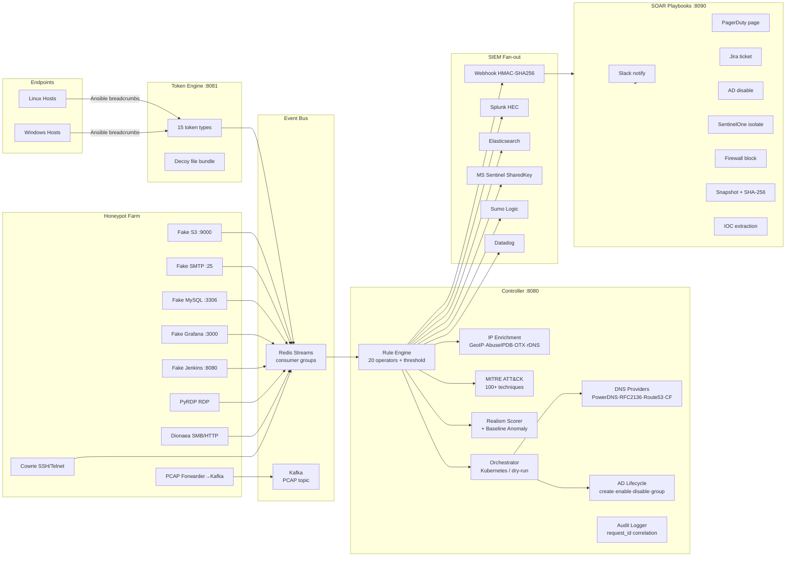

# Architecture

## Overview

ADG is a layered deception platform composed of five independently deployable services that communicate through a shared event bus. Each layer has a single responsibility; no layer has direct access to another's state store.

```
Endpoints / Cloud          →  Breadcrumbs & Tokens
Honeypots / Emulators      →  Event emission
Event Bus (Redis Streams)  →  Durable delivery
Controller                 →  Rules, enrichment, orchestration
SIEM / SOAR               →  Alerting & response
```

## Component diagram



## Trust boundaries

| Boundary | Enforcement |
|---|---|
| Honeypot → Controller | Egress deny network policy; only controller webhook permitted |
| External → Controller | mTLS via ingress (`X-SSL-Client-Verify: SUCCESS`) + JWT RBAC |
| Controller → AD | Dedicated bind user with minimum required LDAP permissions |
| Controller → DNS | Input allowlist sanitisation before any DNS write |
| Controller → SIEM | HMAC-SHA256 webhook signature; TLS to all SIEM endpoints |
| Secrets | Vault or Kubernetes Secrets; never in manifests or code |

## State and availability

| Data | Store | HA option |
|---|---|---|
| Lure deployments, rule state | SQLite (default) | Postgres (`ADG_STATE_DB_URL`) |
| Event bus | In-memory (default) | Redis Streams consumer group (`ADG_BUS_MODE=redis`) |
| Leader election | Redis (`ADG_LEADER_ELECTION=true`) | Shared Redis across replicas |
| Token store | SQLite | Postgres |
| Audit logs | Local file | Ship to SIEM via Filebeat |

## Observability stack

- **Metrics**: Prometheus FastAPI Instrumentator → `/metrics` on each service
- **Tracing**: OpenTelemetry SDK → OTLP exporter → Jaeger or Tempo
- **Logs**: python-json-logger structured JSON → Filebeat → Elasticsearch/Splunk
- **Audit**: Action-level audit log per service with `request_id` correlation
- **Health**: `/health/live` (liveness) and `/health/ready` (checks Postgres, Redis, Vault, SIEM)

## Data storage

| Data type | Path |
|---|---|
| Controller state | `ADG_STATE_DB_URL` (SQLite or Postgres) |
| Audit logs | `ADG_*_AUDIT_LOG_PATH` |
| PCAP ring buffer | `/pcap` emptyDir → Kafka `pcap-events` topic |
| Rule definitions | `ADG_RULES_PATH` (YAML, GitOps) |
| Playbooks | `soar-playbooks/playbooks/*.yaml` |
| Token store | `ADG_TOKEN_DB_PATH` (SQLite) |
